# Configure forecast external data

In this section, you'll enable Workforce Management, create bookable resources and shift activity types, import forecast data, and configure short-term and long-term forecast scenarios.

---

## Task 04: Enable Workforce Management

1. Open a web browser and go to `https://admin.powerplatform.microsoft.com`.

    - Sign in using your administrator credentials.

2. In the left pane, select **Manage**.

    

3. In the **Manage** pane, in the **Products** section, select **Dynamics 365 Apps**.

    

4. Locate the **Workforce Management for Customer Service** app. It may appear as **Workforce Management**.

    

5. Select the ellipsis (**…**) and then select **Install**.

    

6. In the **Install Workforce Management for Customer Service** pane, select your environment.

    

7. Select **I agree to the terms of service** and then select **Install**.

    

   > [!NOTE]
   > It can take up to an hour for workforce management to install in your environment. You can continue on with the tasks in this exercise while installation is in process.

---

## Task 05: Create bookable resources

For service representatives to be scheduled for activities, you must create a bookable resource entity for each representative.

1. In your web browser, go to your Dynamics 365 environment. Your URL should resemble `https://<YourOrgID>.crm.dynamics.com/`.

2. If prompted, sign in by using the administrator credentials for your demo environment.

3. On the **Published Apps** page, select **Copilot Service admin center**.

    

4. In the left navigation pane, in the **Operations** section, select **Workforce management**.

    

5. On the **Workforce management** page, in the **Workforce setup** section, select **View**.

    

6. In the **Users** section, select **Manage**.

    

7. In the **Enabled Users** list, search for and select your administrative user account.

    

8. On the **User** page, on the command bar, select **Omnichannel**.

    

9. On the **Skills Configuration** tile, in the **Bookable Resources (User)** section, select **+ New Bookable Resource**. If the command isn't visible, select the vertical ellipses (**⋮**), and then select **+ New Bookable Resource**.

    

   > [!NOTE]
   > Trial environments might include a pre-provisioned user. If one is available, use that account as your administrative user when you create the bookable resource instead of creating another user account.

10. Enter the following details:

    - Resource Type: **User**

    - Name: Your admin user 

    - User: Set to your user account

    - Time zone: Select your time zone 

    

11. On the command bar, select **Save & Close**.

    

12. On the **Skills Configuration** tile, select the bookable resource record you just created.

    

13. On the command bar for the resource, select **Work hours**.

    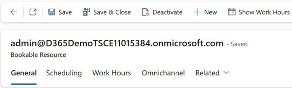

14. Select one event on the calendar. Select **Delete** and then select **All events in the series**. Then, in the confirmation dialog, select **OK**.

    > This step deletes all working hours for the user.

    

15. On the command bar for the calendar, select **+ New** and then select **Working hours**.

    

16. Configure the working hours by using the following information and then select **Save**:

    - **Repeat**: Every Week

    - **Days:** Monday - Friday

    - **Start time:** 8:00 AM

    - **End time:** 5:00 PM

    - **Time Zone:** Set to your timezone.

    

17. Repeat Steps 7 through 16 to create bookable resource records and define working hours for the following users:

    - Alan Steiner

    - Alex Baker

    - Alicia Thomber

    - Amy Alberts

    - Anita Montero

    - Benjamin Mcphee

    - David Mallory

    - Molly Clark

    - Nancy Warner

    - Renee Lo

    - Spencer Low

---

## Task 06: Create shift activity types

1. Open the **Copilot Service admin center** app.

2. In the left navigation pane, select **Workforce management**. Locate the **Shift and schedule management** section.

3. Select **Shift and schedule** management, then next to the **Shift activity Types** section, select **Manage**.

    

4. On the command bar, select **+ New**.

    

5. Configure the **Shift activity** type as follows:

    - **Name:** `Break`

    - **Description:** `Break Time`

    - **Automatic Assignment Status:** Assignable

    - **Duration:** **30 minutes**

    - **Color:** `#c890f5`

    - **Dark theme Color:** `#c890f5`

    

6. On the command bar, select **Save & Close**.

    

7. Repeat Steps 4 through 6 to create the following shift activity types:

    | Name | Description | Duration | Color | Dark Color |
    | --- | --- | --- | --- | --- |
    | Chat Customer Support | Provide support through Chat | 1 Hr 30 Mins | #90bcfs | #90bcfs |
    | Email Customer Support | Providing Support through Email | 1 Hr 30 Mins | #f1f590 | #f1f590 |
    | Training | Training Sessions | 30 Mins | #f57398 | #f57398 |
    | Voice Customer Support | Provide Support via Voice | 1 Hr 30 Mins | #f5da90 | #f5da90 |

---

## Task 07: Import daily and intraday external data

> 
>   BEFORE YOU BEGIN: The two files that you will be importing include information based on dates. DO NOT open the files in excel before importing.  It will change the dates and impact on the way your demo will work.

> 

---

### 01: Import intraday data

1. Extract the files from the zip file that was included in your class materials.

2. At the top of the page, select **Copilot Service admin center**. This displays a list of apps.

    

3. In the list of apps, select **Copilot Service workspace**.

    

4. In the left navigation pane, in the **Workforce management** section, select **Manage External Data**.

   > At the top left of the page, you may need to select the three parallel lines to see the left pane.

   > 

    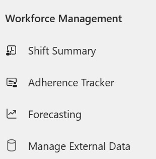

5. On the command bar, select **+ New**.

    

6. In the **Name** field, enter `Contoso Intraday`.

7. In the **File data interval** field, select **Short Term**.

    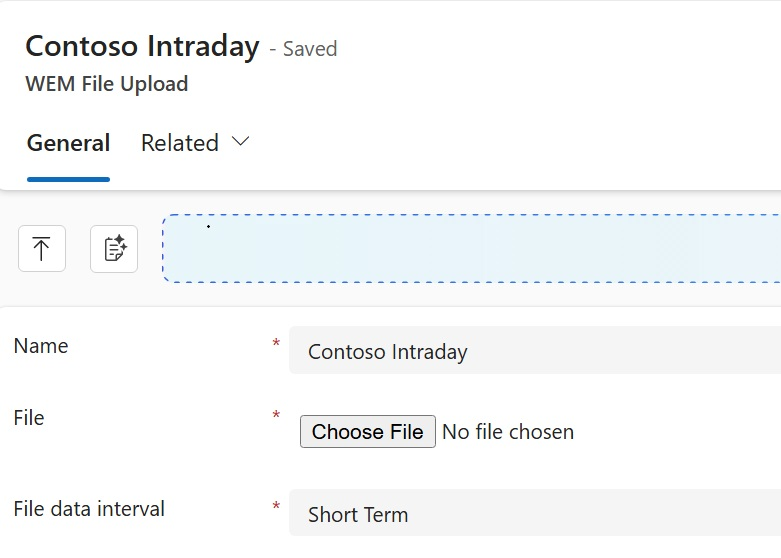

8. In the **File Type** field, select **External historical data for forecast scenario**.

9. On the command bar, select **Save**.  

   > You will not be able to upload a file until you save the record.

    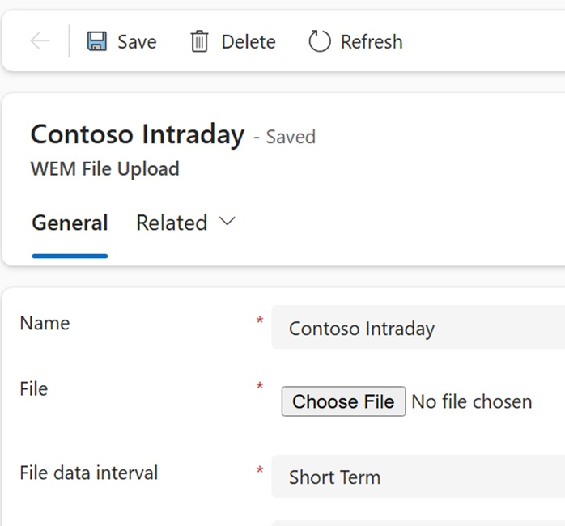

10. Select **Choose File**.

    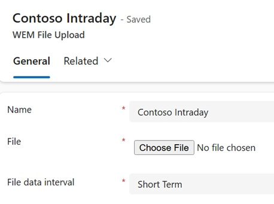

11. Go to the folder that you downloaded and extracted in Exercise 01, Task 2. In the **Service Transformation with AI** subfolder, select **intraday data-20250911** and then select **Open**.

12. On the command bar, select **Save**. 

    > You will not receive any confirmation that the file was saved. 

13. Close the **Contoso Intraday** tab. 

    

14. On the command bar, select **Home**.

    

---

### 02: Import daily data

1. On the command bar, select **+ New**.

2. In the **Name** field, enter `Contoso Daily`.

3. In the **File data interval** field, select **Long Term**.

    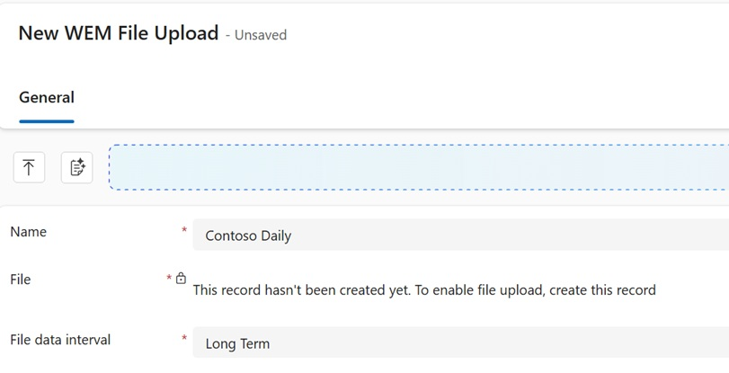

4. In the **File Type** field, select **External historical data for forecast scenario**.

5. On the command bar select **Save**.

    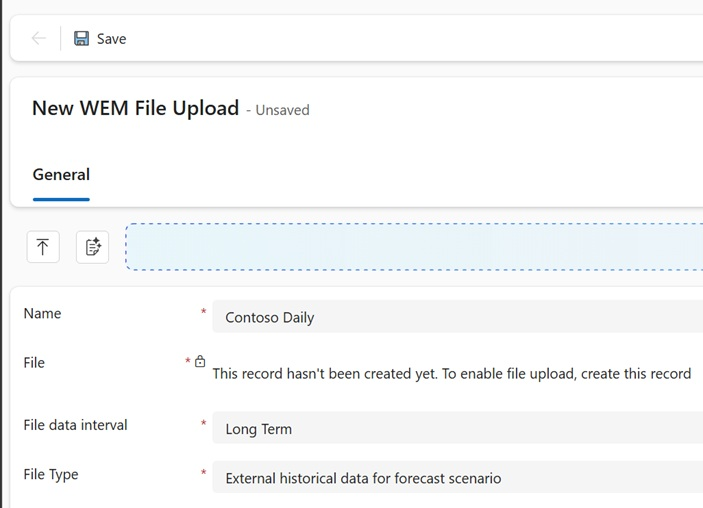

6. Select **Choose File**.

7. Go to the folder that you downloaded and extracted in Exercise 01, Task 2. In the **Service Transformation with AI** subfolder, select **daily data-20250911** and then select **Open**.

8. On the command bar, select **Save**. 

   > You will not receive any confirmation that the file was saved. 

9. Close the **Contoso Daily** tab. 

    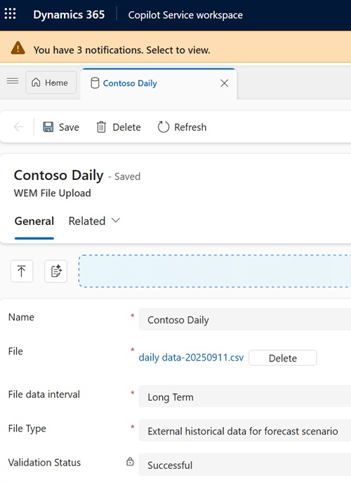

10. On the command bar, select **Home**.

    

---

## Task 08: Create short-term forecasts

1. In **Copilot Service Workspace**, under **Workforce Management**, select **Forecasting**.

    

2. On the command bar, select **+ New** and then select **Short Term Forecast**.

    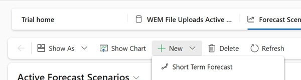

3. Configure the forecast as follows:

    - **Name:** `Sept Short term - Conversation`

    - **Forecast Start Date:** Any future date

    - **Duration (Days):** 42

    - **Interval:** Short Term

    - **Time zone:** (Select your local time zone)

    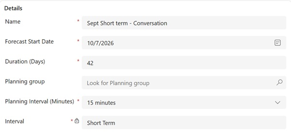

4. Configure the **Historical data** section as follows:

    - **Data source:** External

    - **External data:** `Contoso Intraday`
**
    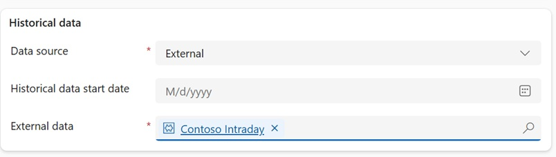

5. In the **Configuration parameters** section, in the **Forecast entity** field, select **Conversation**.

    

6. On the command bar, select **Save**.

7. On the command bar, select **Create New Snapshot**, and then select **Yes**. This schedules the scenario to be run. Select **OK**.

    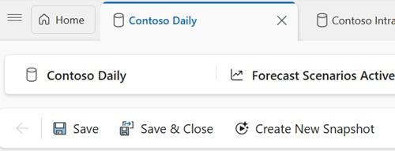

    - Close the **Sept Short Term -Conversation** tab.

    

---

## Task 09: Create a long-term forecast

Now that you have created a short-term forecast, you will create a long-term forecast.

1. In **Copilot Service Workspace**, under **Workforce Management**, select **Forecasting**.

    

2. On the command bar, select **+ New** and then select **Long Term Forecast**.

    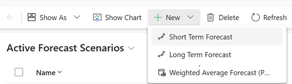

3. Configure the forecast as follows:

    - **Name:** `Sept Long Term - Conversation`

    - **Forecast Start Date:** Any future date

    - **Duration (Days):** 180

    - **Interval:** Long Term

    - **Time zone:** (Select your local time zone)

    

4. In the **Historical data** section, configure as follows:

    - **Data source:** External

    - **External data:** Contoso Daily

    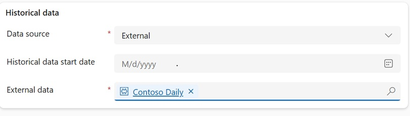

5. In the Forecast entity field, select **Conversation**.

6. On the command bar, select **Save**.

7. On the command bar, select **Create New Snapshot**, and then select **Yes**. This schedules the scenario to be run. Select **OK**.

    

    - Close the **Sept Long Term - Conversation** tab.

    

---

## Task 10: Configure short-term case forecasts

1. In **Copilot Service Workspace**, under **Workforce Management**, select **Forecasting**.

    

2. On the command bar, select **+ New** and then select **Short Term Forecast**.

    

3. Configure the forecast as follows:

    - **Name:** `Sept Short Term - Case`

    - **Duration (Days):** 42

    - **Interval:** Short Term

    - **Time zone:** (Select your local time zone)

    

4. Configure the **Historical data** section as follows:

    - **Data source:** External

    - **Historical data start date:** 1/1/2025

    - **External data:** Contoso Intraday

    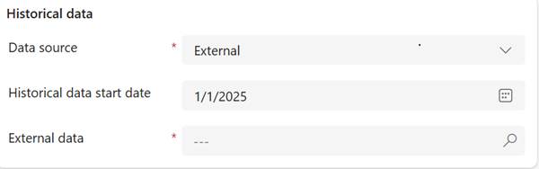

5. In the **Configuration parameters** section, configure as follows:

    - **Forecast entity:** **Case**

    - **Channels:** Select All

    - **Queues:** `Default entity queue`

    > To select the queue, in the **Queues** field, select the **Search** icon and then select **Advanced**. Then, search for and select **Default entity queue**.

    > [!NOTE]
    > In the current Workforce Management experience, the **Channels** and **Queues** fields shown in earlier versions may not be displayed for Case forecast scenarios. If these fields are not available, continue to the next step.

    

6. On the command bar, select **Save**.

7. On the command bar, select **Create New Snapshot** and then select **Yes**. This schedules the scenario to be run. Select **OK**.

    

    - Close the **Sept Short Term - Case** tab.

    

---

## Task 11: Configure long-term case forecasts

1. In **Copilot Service Workspace**, under **Workforce Management**, select **Forecasting**.

    

2. On the command bar, select **+ New** and then select **Long Term Forecast**.

3. Configure the forecast as follows:

    - **Name:** `Sept Long Term - Case`

    - **Forecast Start Date:** Any future date

    - **Duration (Days):** 180

    - **Interval:** Long Term

    - **Time zone:** Select your time zone

    

4. Configure the **Historical data** section as follows:

    - **Data source:** Internal

    - **Historical data start date:** 1/1/2025

    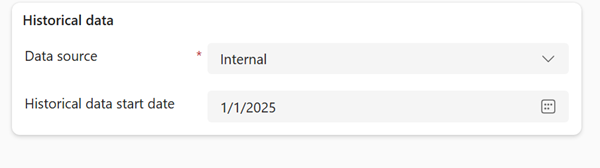

5. In the **Configuration parameters** section, configure as follows:

    - **Forecast entity:** Case

    - **Case Origins:** Select All

    - **Queues:** `Default entity queue`

    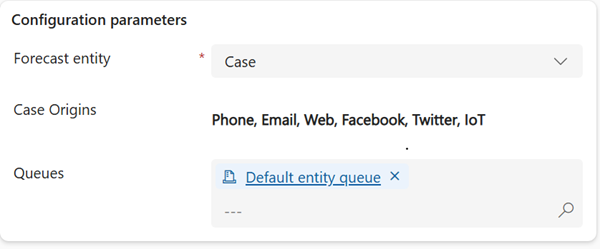

6. Select **Save**.

7. On the command bar, select **Create New Snapshot** and then select **Yes**. This schedules the scenario to be run. Select **OK**.

    - Close the **Sept Long Term - Case** tab.

---

[← Configure users and licenses](02.html){: .btn .mr-2 }
[Import historical data →](04.html){: .btn .btn-purple }
